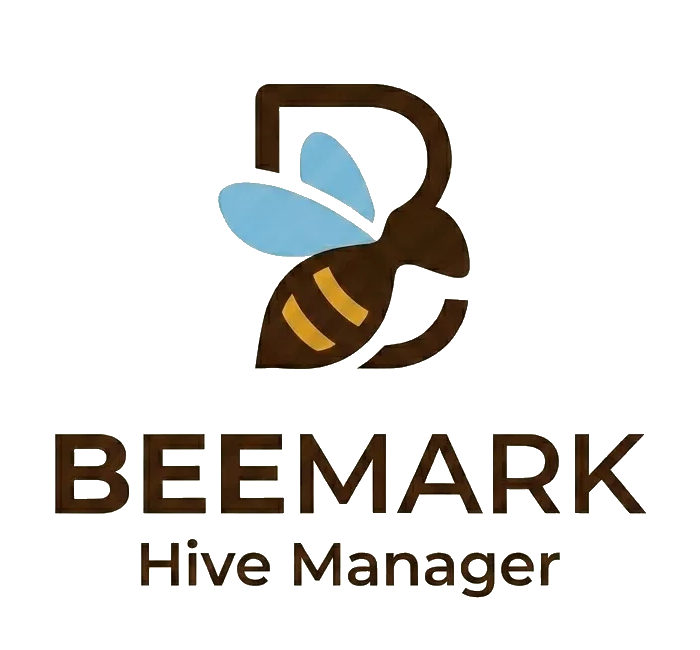

  

<h1 align="center">BeeMark — Hive Manager</h1>

  A mobile-first beekeeping management app for tracking hives, inspections, treatments, and apiaries. 
  Built with React. No server. No account. Just your bees.

  
  
  
  

---

## What is BeeMark?

BeeMark is a practical, no-fuss beekeeping companion designed for real-world use in the apiary. Log inspections, track treatments, manage multiple hives across multiple sites, and access quick-reference beekeeper resources — all from your phone, all stored locally.

No account required. No subscription. No data leaves your device.

---

## Features

### Hive Management
- Add and manage **multiple hives** across multiple apiaries
- Hive types: **National, WBC, Langstroth, Warré, Top-Bar**, with **Nuc** support
- Track **brood boxes, supers, hive colour, location, source, and installation date**
- Hive status tracking: **Queenless**, **Requeening**, and **Archived**
- **Auto queenless detection** — flags a hive if the queen hasn't been seen across two consecutive inspections
- Queen tracking with **BKA colour marking chart** (year-based auto-assignment or custom override)

### Inspection Logging
- Full inspection form with **Yes/No responses** for queen seen, eggs, larvae, capped brood, and queen cells
- Log **frames of brood and stores**, colony **temperament**, and free-text notes
- **Weight logging** — standalone weight-only entries that don't trigger queenless alerts
- Inline **treatment** and **action sub-forms** that auto-populate the relevant tabs
- View past inspections in a read-only detail view with badges for key events

### Treatment Tracking
- Log varroa treatments and other products with **start date and duration**
- **Countdown timers** on active treatments — overdue treatments flagged in red
- Mark treatments complete with a single tap
- Treatments logged during an inspection are automatically added to the Treatment tab

### Actions & Interventions
- Log hive actions including: **Artificial Swarm, Split, Added/Removed Queen, Added/Removed Super, Added/Removed Brood Box, Feed, Clipped Queen**, and more
- Swarm and split actions include **sub-forms** for recording old queen location and hive status after the procedure
- **Auto-creates a new Nuc hive** when a split produces a new colony, carrying forward queen information
- **Feeder tracking** — active feeders shown as a badge on hive list cards; automatically cleared when a feeder is removed

### Multi-Apiary Support
- Manage **multiple apiaries** with names, locations, notes, and optional photos
- Each apiary shows hive count, archived count, total supers, and last inspection date
- Quick-switch between apiaries; tap through to a full apiary detail view
- BeeBase ID field for UK beekeepers registered with the National Bee Unit

### Equipment Shed
- Auto-calculates equipment **in use** from your live hive data (brood boxes, supers, queen excluders, feeders, nucs, roofs, floors, crown boards)
- Set your **total owned quantities** and instantly see how much is spare
- Queen excluder count adjusts seasonally (April–November only)

### Beekeeper Resources
Built-in reference material for the apiary:
- **Queen Marking Colours** — full BKA/BIBBA colour chart by year
- **Bee Lifecycle** — visual timeline bars for queen, worker, and drone development stages
- **UK Pollen Guide** — 65+ plant species with pollen colour swatches, sortable by season, name, or colour

### Data & Backup
- **Export** your full dataset as a dated JSON backup file
- **Import** a backup to restore or transfer your data
- All data stored locally in `localStorage` — nothing is sent anywhere

---

## Tech Stack

| | |
|---|---|
| **Framework** | React (functional components + hooks, no classes) |
| **Styling** | Inline styles with a consistent design token system |
| **Storage** | Browser `localStorage` |
| **Font** | Roboto via Google Fonts |
| **Dependencies** | None — fully self-contained single JSX file |
| **Build step** | None required |

---

## Design

BeeMark uses a warm, clean Android-inspired UI throughout:

- Mint green primary (`#2DBD8F`) with warm off-white backgrounds
- Frosted glass sticky headers with subtle hex pattern backgrounds
- Rounded cards with colour accent bars and hover lift animations
- Consistent badge system for queen-seen, treatments, actions, and queen cells
- UK date formatting (DD/MM/YY) throughout

---

## Running BeeMark

BeeMark is a single `.jsx` file with no build step. To run it:

1. Open it as an artifact in [Claude.ai](https://claude.ai) — it runs directly in the browser
2. Or drop it into any React sandbox (CodeSandbox, StackBlitz, etc.)
3. Or serve it with a minimal Vite/CRA setup if you want a standalone web app

All data persists in your browser's `localStorage`.

---

## Support

If BeeMark is useful to you, consider buying me a coffee:

---

## License

MIT License

Copyright (c) 2026 dewberrybees

Permission is hereby granted, free of charge, to any person obtaining a copy
of this software and associated documentation files (the "Software"), to deal
in the Software without restriction, including without limitation the rights
to use, copy, modify, merge, publish, distribute, sublicense, and/or sell
copies of the Software, and to permit persons to whom the Software is
furnished to do so, subject to the following conditions:

The above copyright notice and this permission notice shall be included in all
copies or substantial portions of the Software.

THE SOFTWARE IS PROVIDED "AS IS", WITHOUT WARRANTY OF ANY KIND, EXPRESS OR
IMPLIED, INCLUDING BUT NOT LIMITED TO THE WARRANTIES OF MERCHANTABILITY,
FITNESS FOR A PARTICULAR PURPOSE AND NONINFRINGEMENT. IN NO EVENT SHALL THE
AUTHORS OR COPYRIGHT HOLDERS BE LIABLE FOR ANY CLAIM, DAMAGES OR OTHER
LIABILITY, WHETHER IN AN ACTION OF CONTRACT, TORT OR OTHERWISE, ARISING FROM,
OUT OF OR IN CONNECTION WITH THE SOFTWARE OR THE USE OR OTHER DEALINGS IN THE
SOFTWARE.
